# 糖葫芦享屏 (THLPlay) - 产品技术文档

[](https://testflight.apple.com/join/YUS31axK)
[](https://play.google.com/apps/internaltest/4701637473484882073)
[](#-平台使用指南)
[](PRIVACY_POLICY.md)
[](https://t.me/tanghulutvos)

糖葫芦享屏 (THLPlay) 是一款专为 高性能镜像与音视频接收解决方案。本产品采用私有优化协议栈，支持 高清投屏与超低延迟音频流传输。

> ⚠️ **声明：本项目核心协议栈为闭源商业项目，当前仓库仅作为产品主页、使用文档与技术架构展示。**
> 
> 🎉 **立即体验【糖葫芦享屏】!**  
> 体验极致流畅的 4K 投屏与无损音频传输，欢迎加入我们的内测：  
> * 👉 **Apple 用户**：[点击此处参与 TestFlight 内测](https://testflight.apple.com/join/YUS31axK)  
> * 👉 **Android 用户**：[点击此处参与 Google Play 内部测试](https://play.google.com/apps/internaltest/4701637473484882073)  
> 
> > 📝 **Android 参与内测完整说明：**
> > 1. **获取测试资格**：Google Play 内部测试需要您的 Google 账号在受邀名单中。如果您点击上述链接时提示“应用不可用”或“测试项目尚未开始”，请加入我们的 [Telegram 交流群](https://t.me/tanghulutvos) 联系管理员，或通过邮件提供您的 Google 账号以添加测试权限。
> > 2. **接受测试邀请**：确保您的浏览器登录了已获得授权的 Google 账号，点击上面的 [内测链接](https://play.google.com/apps/internaltest/4701637473484882073)，在打开的页面中点击 **“接受邀请” (Become a Tester)**。
> > 3. **安装测试版**：接受邀请后，点击页面下方的 **“在 Google Play 上下载它” (Download it on Google Play)** 链接，或者直接在已登录该账号的 Android 设备的 Google Play 商店中搜索并安装【糖葫芦享屏】。


## 1. 产品核心特性

- **极致性能响应**:
  - **音频**: 基于 AudioQueue Services 的渲染引擎，内置 16 级高性能缓冲池，彻底消除杂音与延迟。
  - **视频**: 深度集成 `AVSampleBufferDisplayLayer` 硬件加速，支持 4K/60fps 镜像流。
- **底层网络优化**:
  - 针对 iOS/tvOS 沙箱环境优化的 `NWListenerBridge` 技术，绕过传统 Socket 限制，显著提升局域网设备搜索成功率与连接稳定性。
- **多端原生支持**:
  - 深度适配 iPhone, iPad, Apple TV 及 Mac (Catalyst)，提供一致的交互体验。
- **专业级 UI/UX**:
  - 全新毛玻璃（Glassmorphism）视觉体系，适配各平台最新系统风格。

## 2. 技术规格

- **应用层**: SwiftUI / Swift Concurrency
- **渲染引擎**: AVFoundation / AudioQueue 硬件加速
- **协议栈**:
  - 基于 C 语言深度定制的 RAOP、FairPlay、libplist 核心组件。
  - **THLPlayBridge**: 高性能 Objective-C 桥接层。
  - **NWListener**: 基于苹果原生 Network.framework 的现代传输层。

## 3. 平台使用指南

点击下方平台名称切换查看对应的使用说明与界面截图：

<details open>
<summary><b>📱 iOS (iPhone)</b></summary>

### 快速开始
1. **启动应用**：在 iPhone 上打开“糖葫芦享屏”。
2. **连接网络**：确保手机与发送端（如另一台设备）处于同一 Wi-Fi。
3. **开始投屏**：在发送端选择此 iPhone 即可实现音视频镜像。

### 界面预览
| 首页 | 投屏状态 | 设置 | 关于我们 |
| :---: | :---: | :---: | :---: |
| 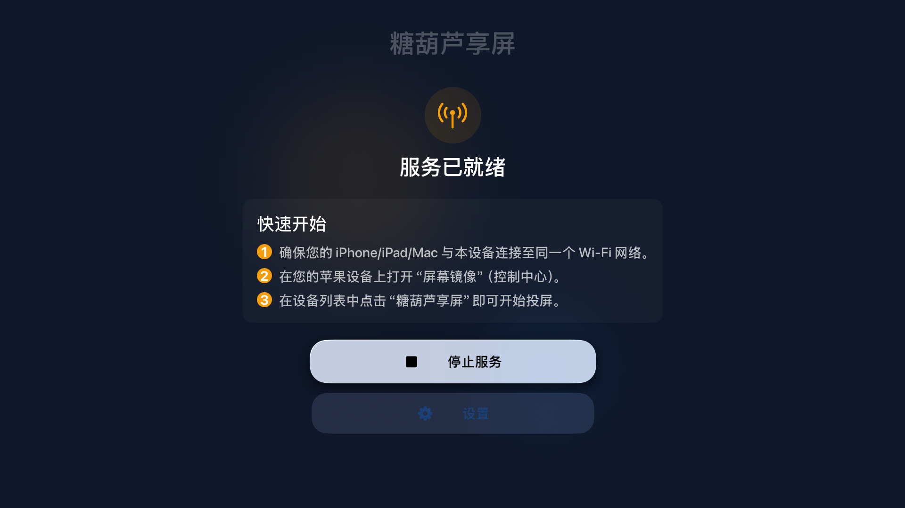 | 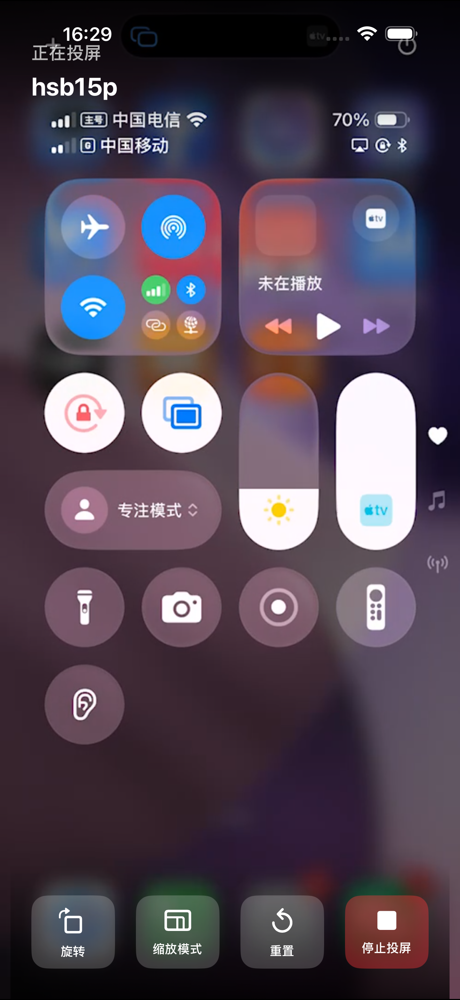 | 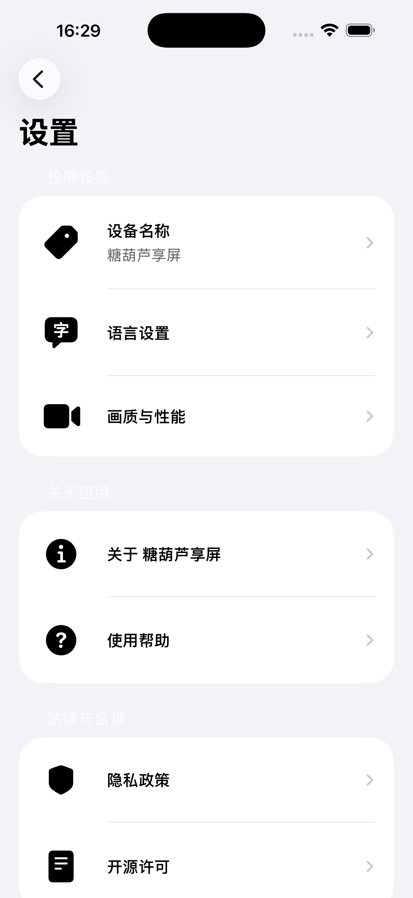 | 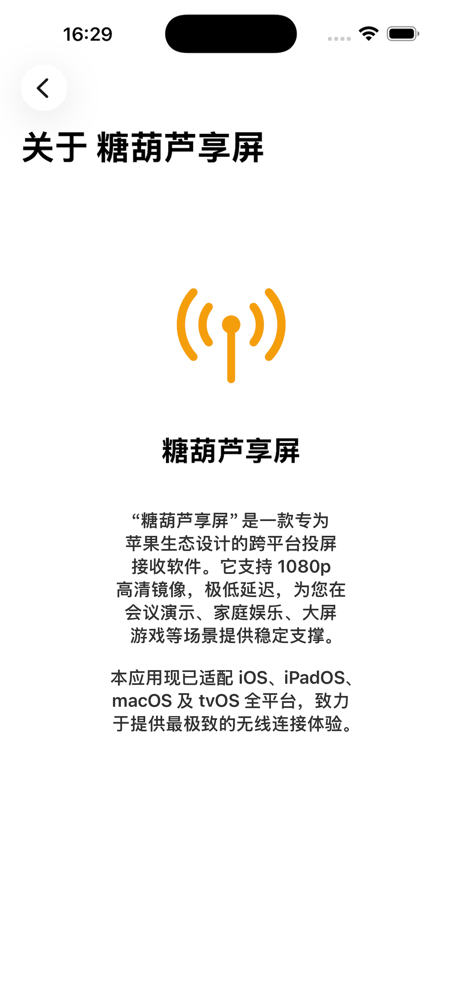 |

</details>

<br>

<details>
<summary><b>平板 iPadOS</b></summary>

### 快速开始
1. **启动应用**：在 iPad 上启动程序，利用大屏优势享受高清镜像。
2. **多任务支持**：支持 Split View，边看投屏边处理文档。

### 界面预览
| 首页 | 投屏状态 | 设置 | 关于我们 |
| :---: | :---: | :---: | :---: |
| 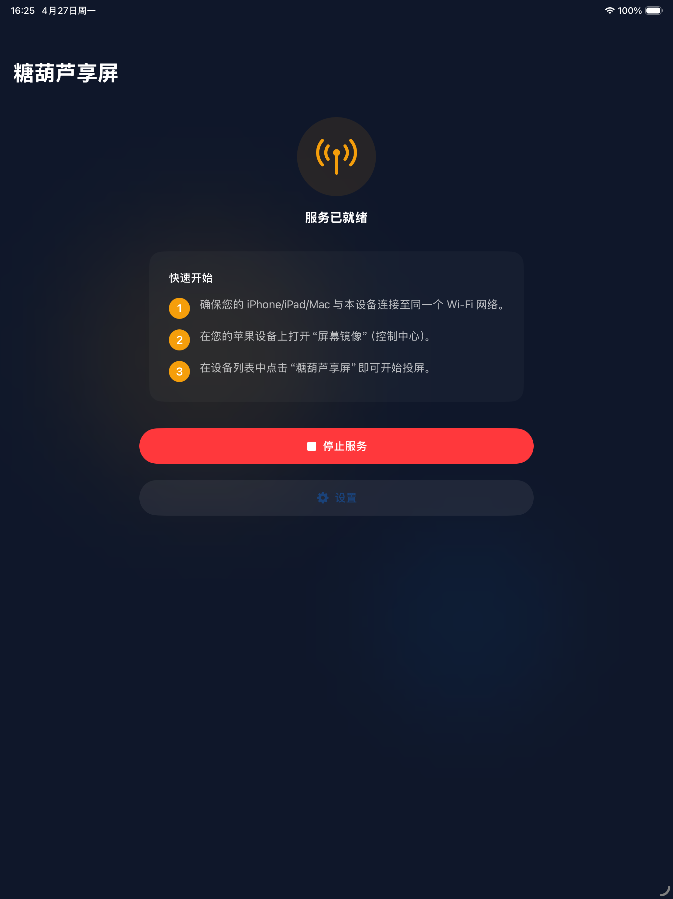 | 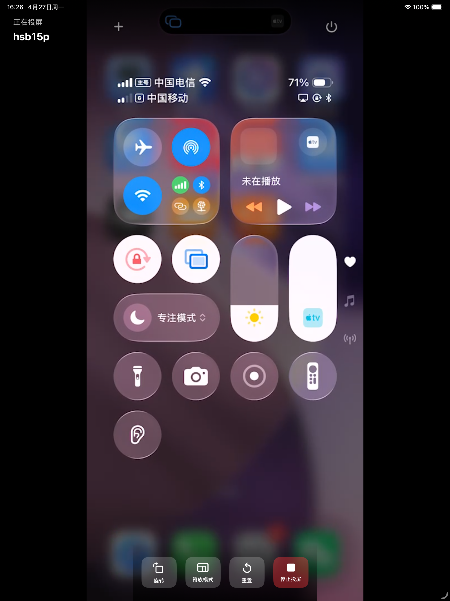 | 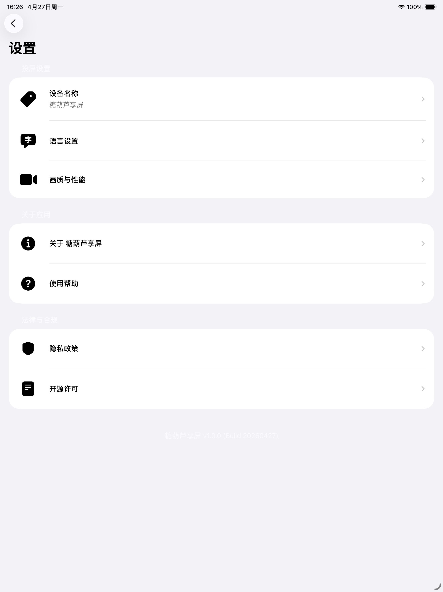 | 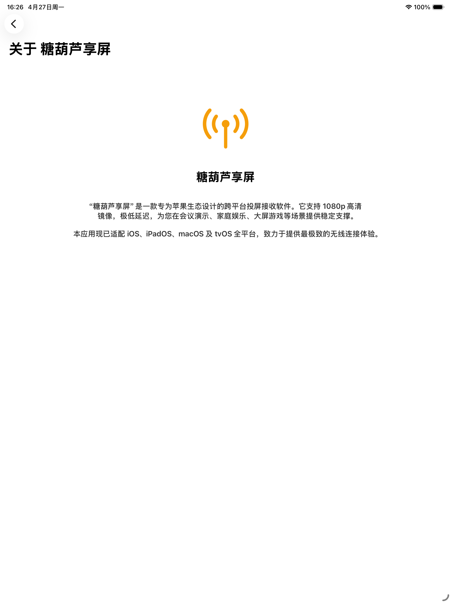 |

</details>

<br>

<details>
<summary><b>📺 Apple TV (tvOS)</b></summary>

### 快速开始
1. **大屏呈现**：在 Apple TV 上打开应用，将电视变为高性能 AirPlay 接收器。
2. **遥控器操作**：使用 Siri Remote 轻松管理连接设备与设置选项。

### 界面预览
| 首页 | 投屏状态 | 设置 | 关于我们 |
| :---: | :---: | :---: | :---: |
|  | 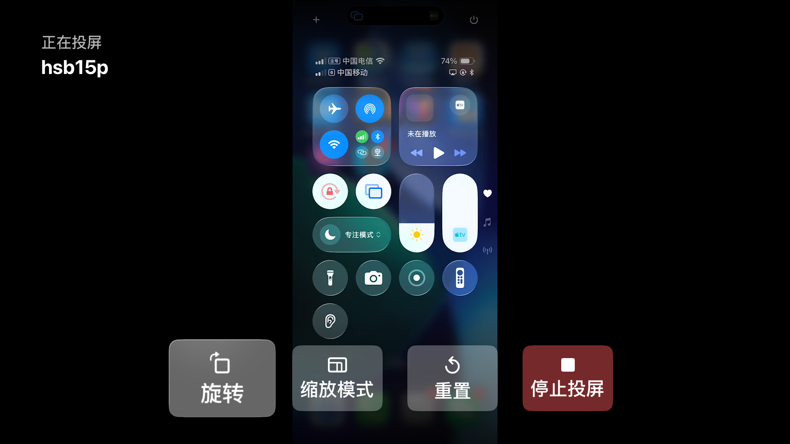 | 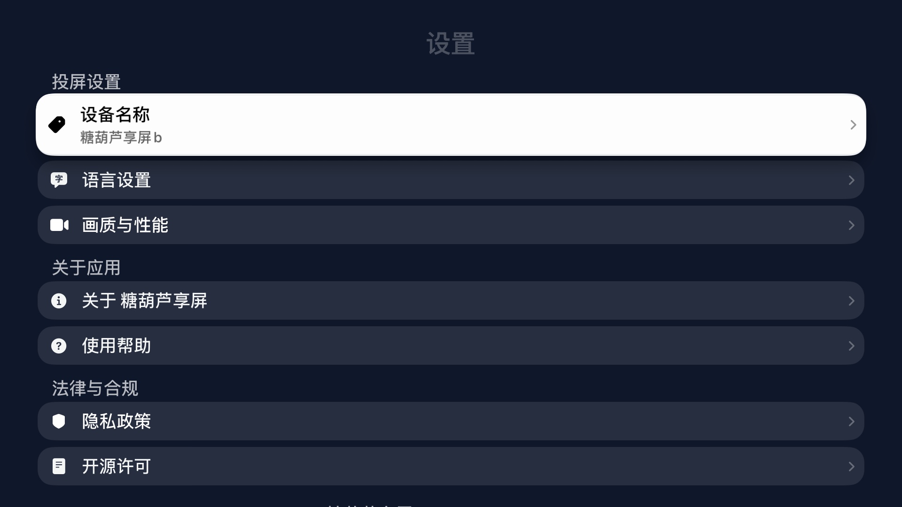 | 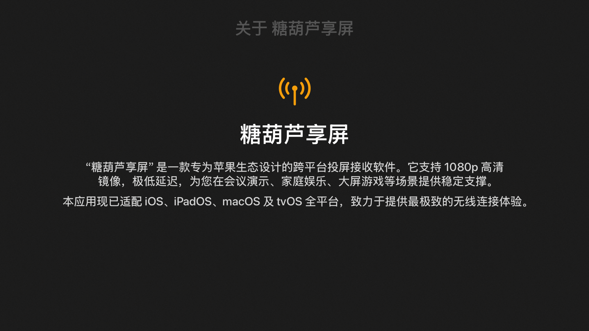 |
</details>

<br>

<details>
<summary><b>💻 macOS (Catalyst)</b></summary>

### 快速开始
1. **启动应用**：在 Mac 上运行“糖葫芦享屏”，支持在菜单栏快速访问。
2. **窗口管理**：支持自由缩放投屏窗口，利用 macOS 的多任务处理能力。

### 界面预览
| 首页 | 投屏状态 | 设置 | 关于我们 |
| :---: | :---: | :---: | :---: |
| 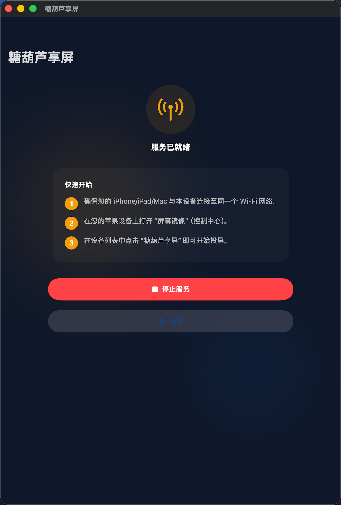 | 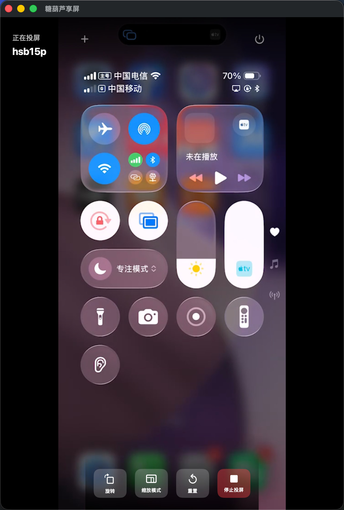 | 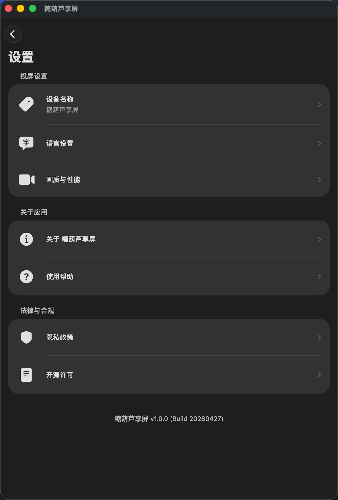 | 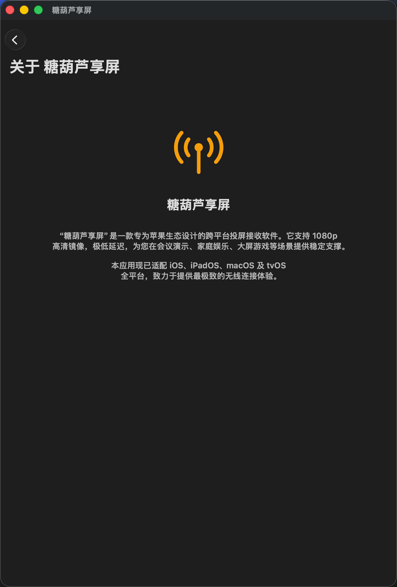 |

</details>

<br>

<details>
<summary><b>🤖 Android</b></summary>

### 快速开始
1. **参与内测**：通过 [Google Play 内部测试链接](https://play.google.com/apps/internaltest/4701637473484882073) 接受邀请并获取下载资格。
   * *注：若提示不可用，请前往 [Telegram 交流群](https://t.me/tanghulutvos) 联系管理员开通测试权限。*
2. **安装应用**：在 Google Play 商店中下载并安装“糖葫芦享屏”。
3. **连接网络**：确保 Android 设备与发送端（如 iPhone 或 Mac）处于同一 Wi-Fi 局域网。
4. **开始投屏**：在发送端设备上发起 AirPlay / DLNA 投屏，选择此 Android 设备即可享受超低延迟的高清投屏接收。

</details>

---

## 4. 开发与环境配置 (仅限内部人员)

### 环境要求
- Xcode 15.0 或更高版本
- iOS 14.0+ / tvOS 14.0+ / macOS 11.0+
- CocoaPods 1.12+

### 编译步骤
1. 打开终端，进入项目根目录。
2. 执行依赖安装：
   ```bash
   pod install
   ```
3. 使用 Xcode 打开生成的 `THLAirPlayApp.xcworkspace`。
4. 确保开发证书配置正确，选择目标设备进行编译运行。

## 5. 项目结构说明
- `THLAirPlayApp/`: SwiftUI 交互逻辑与业务代码。
- `Renderers/`: 音视频 hardware 加速渲染核心。
- `Sources/`: 桥接组件及 Network.framework 通讯层。
- `lib/`: 经过安全加固与性能优化的私有协议核心库。

---

## 6. 联系我们

如果您在使用过程中有任何问题、建议或需要获取测试资格与授权，欢迎通过以下方式与我们取得联系：

- **官方网站**：[www.thltv.com](https://www.thltv.com/)
- **GitHub 仓库**：[localsend_never88gone](https://github.com/never88gone/localsend_never88gone)
- **Telegram 频道**：[糖葫芦享屏 (THLPlay)](https://t.me/tanghulutvos)
- **联系邮箱**：[support@thltv.com](mailto:support@thltv.com)

---

## 7. 版权与许可

© 2026 糖葫芦享屏开发团队。保留所有权利。

[隐私政策 (Privacy Policy)](PRIVACY_POLICY.md)

本软件及其相关文档包含的所有技术细节、源代码及设计方案均为商业机密。未经书面授权，禁止以任何形式进行复制、分发、反编译或在第三方项目中使用。
